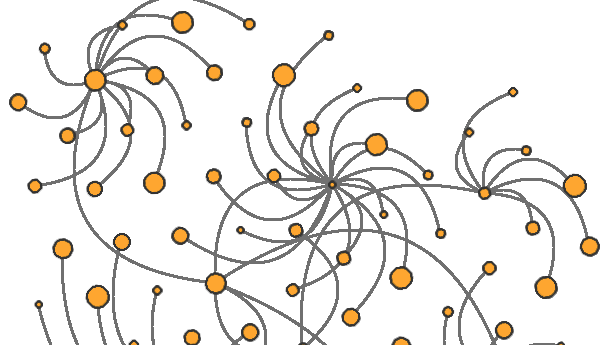

# Bresenham rasterisation functions by Alois Zingl



Port of [C code](https://gist.github.com/w8r/2f57de439a736b0a079b70ed24c9a246) by Alois Zingl from this paper

[ALOIS ZINGL: "A Rasterizing Algorithm for Drawing Curves", 8 November 2012 (2012-11-08), pages 1 - 81](https://github.com/Traumflug/Teacup_Firmware/raw/master/research/A_Rasterizing_Algorithm_for_Drawing_Curves_-_Alois_Zingl_2012.pdf)

## Install

```
npm i -S bresenham-zingl
```

```js
import { line, circle, quadBezier } from "bresenham-zingl";

quadBezier(0, 0, 10, 10, 0, 10, (x, y) => console.log(x, y)); // 0,0, ...
```

## [Demo](https://w8r.github.io/bresenham-zingl/demo/)

## API

All coordinates are integers. All functions are pure — they only call the
supplied callback(s) and have no side effects.

### Callback types

| Type | Signature | Description |
| ---- | --------- | ----------- |
| `SetPixelFn` | `(x: number, y: number) => void` | Plot a single pixel at `(x, y)`. |
| `SetPixelAlphaFn` | `(x: number, y: number, alpha: number) => void` | Plot a pixel with coverage. `alpha` is **0 = fully opaque, 255 = fully transparent** (Zingl convention). |
| `SetHLineFn` | `(x0: number, x1: number, y: number) => void` | Fill a horizontal span from `x0` to `x1` (inclusive) on row `y`. Used by filled shapes. |

---

### Lines

#### `line(x0, y0, x1, y1, setPixel)`

Rasterise a line segment using Bresenham's algorithm.

| Parameter | Type | Description |
| --------- | ---- | ----------- |
| `x0`, `y0` | `number` | Start point. |
| `x1`, `y1` | `number` | End point. |
| `setPixel` | `SetPixelFn` | Called for every pixel on the line. |

#### `lineAA(x0, y0, x1, y1, setPixelAA)`

Anti-aliased line using Wu's algorithm.

| Parameter | Type | Description |
| --------- | ---- | ----------- |
| `x0`, `y0` | `number` | Start point. |
| `x1`, `y1` | `number` | End point. |
| `setPixelAA` | `SetPixelAlphaFn` | Called with coverage for each pixel. |

#### `lineWidth(x0, y0, x1, y1, wd, setPixelAA)`

Anti-aliased line with a given stroke width.

| Parameter | Type | Description |
| --------- | ---- | ----------- |
| `x0`, `y0` | `number` | Start point. |
| `x1`, `y1` | `number` | End point. |
| `wd` | `number` | Stroke width in pixels. |
| `setPixelAA` | `SetPixelAlphaFn` | Called with coverage for each pixel. |

---

### Circles

#### `circle(xm, ym, r, setPixel)`

Rasterise a circle outline (Bresenham midpoint algorithm).

| Parameter | Type | Description |
| --------- | ---- | ----------- |
| `xm`, `ym` | `number` | Centre. |
| `r` | `number` | Radius. |
| `setPixel` | `SetPixelFn` | Called for each pixel on the outline. |

#### `disc(xm, ym, r, setHLine)`

Rasterise a filled circle (disc) using horizontal spans.

| Parameter | Type | Description |
| --------- | ---- | ----------- |
| `xm`, `ym` | `number` | Centre. |
| `r` | `number` | Radius. |
| `setHLine` | `SetHLineFn` | Called once per row to fill a horizontal span. |

#### `circleAA(xm, ym, r, setPixelAA)`

Anti-aliased circle outline.

| Parameter | Type | Description |
| --------- | ---- | ----------- |
| `xm`, `ym` | `number` | Centre. |
| `r` | `number` | Radius. |
| `setPixelAA` | `SetPixelAlphaFn` | Called with coverage for each pixel. |

---

### Ellipses

#### `ellipse(xm, ym, a, b, setPixel)`

Rasterise an axis-aligned ellipse outline.

| Parameter | Type | Description |
| --------- | ---- | ----------- |
| `xm`, `ym` | `number` | Centre. |
| `a` | `number` | Semi-axis along x. |
| `b` | `number` | Semi-axis along y. |
| `setPixel` | `SetPixelFn` | Called for each pixel on the outline. |

#### `ellipseRect(x0, y0, x1, y1, setPixel)`

Rasterise an ellipse inscribed in an axis-aligned bounding rectangle (the
ellipse touches all four sides). Equivalent to `ellipse` but specified by
corner coordinates instead of centre + radii.

| Parameter | Type | Description |
| --------- | ---- | ----------- |
| `x0`, `y0` | `number` | Top-left corner of the bounding rectangle. |
| `x1`, `y1` | `number` | Bottom-right corner of the bounding rectangle. |
| `setPixel` | `SetPixelFn` | Called for each pixel on the outline. |

#### `rotatedEllipse(x, y, a, b, angle, setPixel)`

Rasterise a rotated ellipse given centre, semi-axes, and rotation angle.
Internally delegates to `rotatedEllipseRect`.

> **Note:** Due to floating-point intermediate coordinates, a small line
> artefact can appear for certain input combinations. Prefer
> `rotatedEllipseRect` with hand-crafted integer coordinates when pixel-perfect
> output is required.

| Parameter | Type | Description |
| --------- | ---- | ----------- |
| `x`, `y` | `number` | Centre. |
| `a` | `number` | Semi-major axis (before rotation). |
| `b` | `number` | Semi-minor axis (before rotation). |
| `angle` | `number` | Rotation angle in radians. |
| `setPixel` | `SetPixelFn` | Called for each pixel on the outline. |

#### `rotatedEllipseRect(x0, y0, x1, y1, zd, setPixel)`

Rasterise a rotated ellipse specified by its bounding rectangle and a shear
parameter. All inputs must be integers for artefact-free output.

`zd` encodes the rotation: `w = (W·H − zd) / (2·W·H)` where `W = x1−x0`,
`H = y1−y0`. Valid range: `|zd| ≤ W·H` (i.e. `w ∈ [0, 1]`). `zd = 0`
produces an ordinary axis-aligned ellipse.

| Parameter | Type | Description |
| --------- | ---- | ----------- |
| `x0`, `y0` | `number` | Top-left corner of the bounding rectangle (integer). |
| `x1`, `y1` | `number` | Bottom-right corner of the bounding rectangle (integer). |
| `zd` | `number` | Rotation/shear parameter. Must satisfy `|zd| ≤ (x1−x0)·(y1−y0)`. |
| `setPixel` | `SetPixelFn` | Called for each pixel on the outline. |

---

### Quadratic Bézier curves

#### `quadBezier(x0, y0, x1, y1, x2, y2, setPixel)`

Rasterise any quadratic Bézier curve. Subdivides at gradient-sign changes
and delegates to `quadBezierSegment`.

| Parameter | Type | Description |
| --------- | ---- | ----------- |
| `x0`, `y0` | `number` | Start point P0. |
| `x1`, `y1` | `number` | Control point P1. |
| `x2`, `y2` | `number` | End point P2. |
| `setPixel` | `SetPixelFn` | Called for each pixel on the curve. |

#### `quadBezierAA(x0, y0, x1, y1, x2, y2, setPixelAA)`

Anti-aliased version of `quadBezier`.

| Parameter | Type | Description |
| --------- | ---- | ----------- |
| `x0`, `y0` | `number` | Start point P0. |
| `x1`, `y1` | `number` | Control point P1. |
| `x2`, `y2` | `number` | End point P2. |
| `setPixelAA` | `SetPixelAlphaFn` | Called with coverage for each pixel. |

#### `quadBezierSegment(x0, y0, x1, y1, x2, y2, setPixel)` _(low-level)_

Rasterise a **limited** quadratic Bézier segment. The segment must satisfy the
Zingl slope constraint: the gradient must not change sign between P0→P1 and
P1→P2 in either axis. Use `quadBezier` for arbitrary curves.

| Parameter | Type | Description |
| --------- | ---- | ----------- |
| `x0`, `y0` | `number` | Start point. |
| `x1`, `y1` | `number` | Control point. |
| `x2`, `y2` | `number` | End point. |
| `setPixel` | `SetPixelFn` | Called for each pixel on the curve. |

#### `quadBezierSegmentAA(x0, y0, x1, y1, x2, y2, setPixelAA)` _(low-level)_

Anti-aliased version of `quadBezierSegment`.

| Parameter | Type | Description |
| --------- | ---- | ----------- |
| `x0`, `y0` | `number` | Start point. |
| `x1`, `y1` | `number` | Control point. |
| `x2`, `y2` | `number` | End point. |
| `setPixelAA` | `SetPixelAlphaFn` | Called with coverage for each pixel. |

---

### Rational quadratic Bézier curves

#### `quadRationalBezier(x0, y0, x1, y1, x2, y2, w, setPixel)`

Rasterise any rational quadratic Bézier curve (conic section). `w < 1` gives
an elliptic arc, `w = 1` a parabola, `w > 1` a hyperbolic arc. Subdivides at
gradient-sign changes and delegates to `quadRationalBezierSegment`.

| Parameter | Type | Description |
| --------- | ---- | ----------- |
| `x0`, `y0` | `number` | Start point P0. |
| `x1`, `y1` | `number` | Control point P1. |
| `x2`, `y2` | `number` | End point P2. |
| `w` | `number` | Weight (≥ 0). Controls curve type: `0 < w < 1` → elliptic arc, `w = 1` → parabola, `w > 1` → hyperbolic arc. |
| `setPixel` | `SetPixelFn` | Called for each pixel on the curve. |

#### `quadRationalBezierSegment(x0, y0, x1, y1, x2, y2, w, setPixel)` _(low-level)_

Rasterise a **limited** rational quadratic Bézier segment (squared weight).
Inputs must be integer coordinates satisfying the Zingl slope constraint.

| Parameter | Type | Description |
| --------- | ---- | ----------- |
| `x0`, `y0` | `number` | Start point. |
| `x1`, `y1` | `number` | Control point. |
| `x2`, `y2` | `number` | End point. |
| `w` | `number` | Squared weight. |
| `setPixel` | `SetPixelFn` | Called for each pixel on the curve. |

#### `quadRationalBezierSegmentAA(x0, y0, x1, y1, x2, y2, w, setPixelAA)` _(low-level)_

Anti-aliased version of `quadRationalBezierSegment`.

| Parameter | Type | Description |
| --------- | ---- | ----------- |
| `x0`, `y0` | `number` | Start point. |
| `x1`, `y1` | `number` | Control point. |
| `x2`, `y2` | `number` | End point. |
| `w` | `number` | Squared weight. |
| `setPixelAA` | `SetPixelAlphaFn` | Called with coverage for each pixel. |

---

### Cubic Bézier curves

#### `cubicBezier(x0, y0, x1, y1, x2, y2, x3, y3, setPixel)`

Rasterise any cubic Bézier curve. Subdivides at gradient-sign changes and
delegates to `cubicBezierSegment`.

| Parameter | Type | Description |
| --------- | ---- | ----------- |
| `x0`, `y0` | `number` | Start point P0. |
| `x1`, `y1` | `number` | Control point P1. |
| `x2`, `y2` | `number` | Control point P2. |
| `x3`, `y3` | `number` | End point P3. |
| `setPixel` | `SetPixelFn` | Called for each pixel on the curve. |

#### `cubicBezierAA(x0, y0, x1, y1, x2, y2, x3, y3, setPixelAA)`

Anti-aliased version of `cubicBezier`.

| Parameter | Type | Description |
| --------- | ---- | ----------- |
| `x0`, `y0` | `number` | Start point P0. |
| `x1`, `y1` | `number` | Control point P1. |
| `x2`, `y2` | `number` | Control point P2. |
| `x3`, `y3` | `number` | End point P3. |
| `setPixelAA` | `SetPixelAlphaFn` | Called with coverage for each pixel. |

#### `cubicBezierSegment(x0, y0, x1, y1, x2, y2, x3, y3, setPixel)` _(low-level)_

Rasterise a **limited** cubic Bézier segment. The segment must satisfy both
Zingl slope constraints:

- `(x1−x0)·(x2−x3) ≤ 0` — x-slopes at P0 and P3 point in opposite directions
- `(y1−y0)·(y2−y3) ≤ 0` — same for y

Use `cubicBezier` for arbitrary curves; the higher-level function handles
subdivision automatically. Throws if constraints are violated.

| Parameter | Type | Description |
| --------- | ---- | ----------- |
| `x0`, `y0` | `number` | Start point. |
| `x1`, `y1` | `number` | Control point P1. |
| `x2`, `y2` | `number` | Control point P2. |
| `x3`, `y3` | `number` | End point. |
| `setPixel` | `SetPixelFn` | Called for each pixel on the curve. |

#### `cubicBezierSegmentAA(x0, y0, x1, y1, x2, y2, x3, y3, setPixelAA)` _(low-level)_

Anti-aliased version of `cubicBezierSegment`. Same slope constraints apply.

| Parameter | Type | Description |
| --------- | ---- | ----------- |
| `x0`, `y0` | `number` | Start point. |
| `x1`, `y1` | `number` | Control point P1. |
| `x2`, `y2` | `number` | Control point P2. |
| `x3`, `y3` | `number` | End point. |
| `setPixelAA` | `SetPixelAlphaFn` | Called with coverage for each pixel. |

## License

(The MIT License)

Copyright (c) 2012 Alois Zingl

Permission is hereby granted, free of charge, to any person obtaining a copy of this software and associated documentation files (the 'Software'), to deal in the Software without restriction, including without limitation the rights to use, copy, modify, merge, publish, distribute, sublicense, and/or sell copies of the Software, and to permit persons to whom the Software is furnished to do so, subject to the following conditions:

The above copyright notice and this permission notice shall be included in all copies or substantial portions of the Software.

THE SOFTWARE IS PROVIDED 'AS IS', WITHOUT WARRANTY OF ANY KIND, EXPRESS OR IMPLIED, INCLUDING BUT NOT LIMITED TO THE WARRANTIES OF MERCHANTABILITY, FITNESS FOR A PARTICULAR PURPOSE AND NONINFRINGEMENT. IN NO EVENT SHALL THE AUTHORS OR COPYRIGHT HOLDERS BE LIABLE FOR ANY CLAIM, DAMAGES OR OTHER LIABILITY, WHETHER IN AN ACTION OF CONTRACT, TORT OR OTHERWISE, ARISING FROM, OUT OF OR IN CONNECTION WITH THE SOFTWARE OR THE USE OR OTHER DEALINGS IN THE SOFTWARE.
